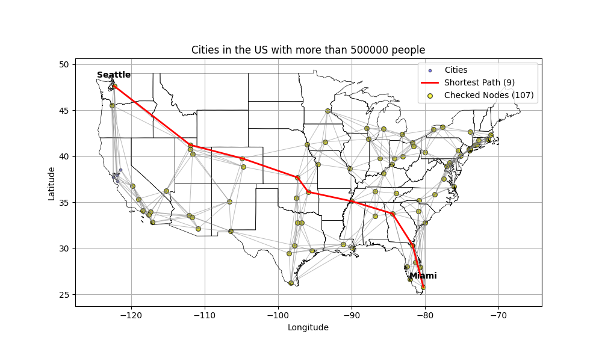
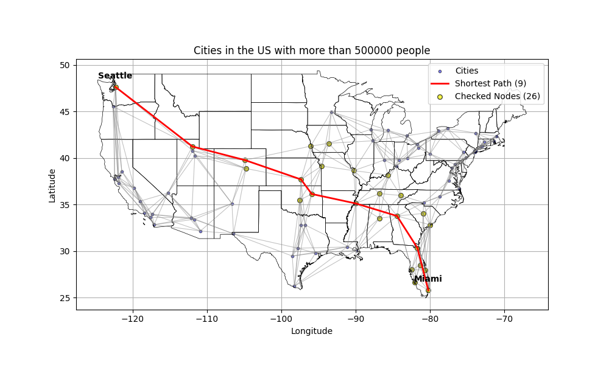
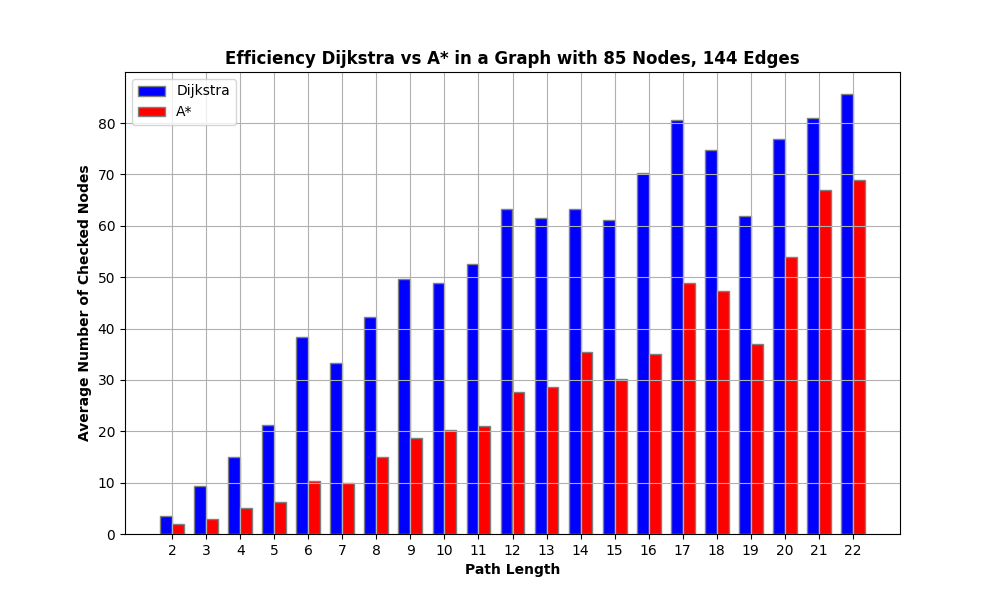
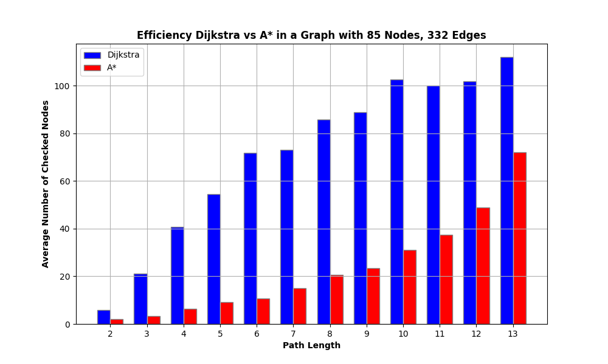
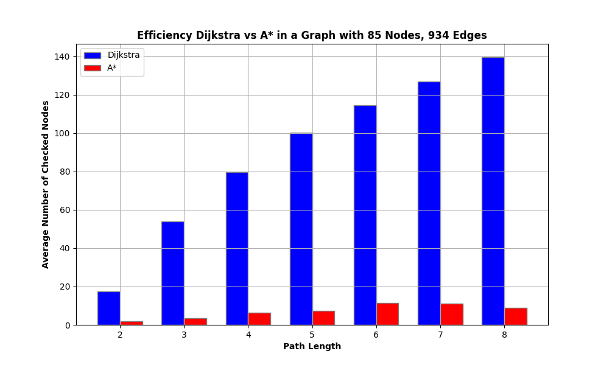
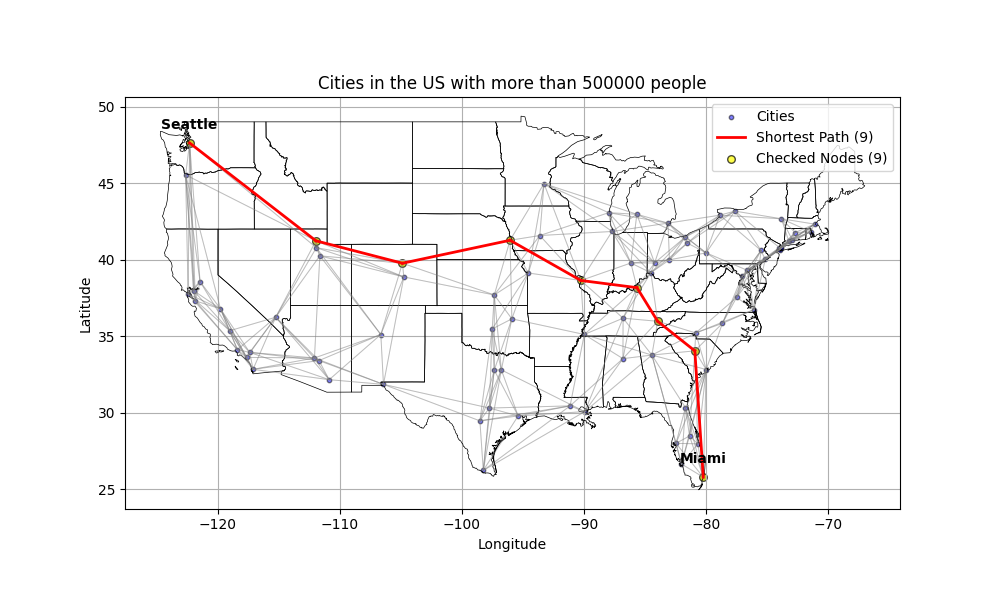
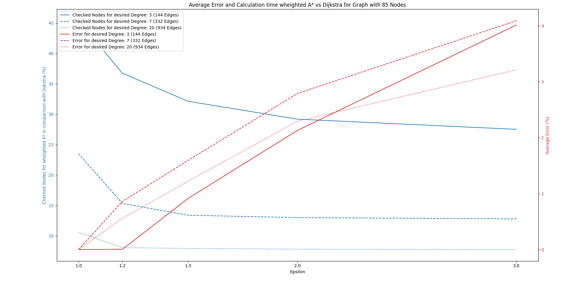

# Single Shortest Path Problem Solver

## Overview

This project focuses on solving the Single Shortest Path Problem using two well-known algorithms: Dijkstra and A*. The graph for this project is constructed from city data within the United States. The complexity of the graph is adjustable, allowing for the inclusion of different numbers of cities (for example, all cities with a population over 100,000) and varying degrees of connectivity, which represent the number of connections each city has to its neighboring cities.

By adjusting the `minimum_population` threshold, the number of nodes (cities) in the graph can be changed. Additionally, altering the degree of connectivity changes the number of edges (connections) each city has. This setup enables comprehensive testing and comparison of the performance of the Dijkstra and A* algorithms under various conditions.

## Project Structure

- `main.py`: Main script to run the project.
- `get_data.py`: Script to download and preprocess city data.
- `make_graph.py`: Script to create the graph.
- `plot.py`: Script to generate plots for visualization.
- `sspp_solvers.py`: Contains the implementations of the Dijkstra and A* algorithms.
- `evaluate.py`: Evaluate the performance of the Dijkstra and the A* Algorithm.
- `evaluate_weighted_astar.py`: Evaluate the performance of the weighted A* Algorithm.

## Data Source

City data is downloaded as a CSV file from [Simple Maps](https://simplemaps.com/data/us-cities). This data includes the population and coordinates of many cities in the US. The coordinates are essential for determining the cost of the shortest path and the city's location in the graph. The cost of a connection between two cities is calculated using the Haversine distance, which measures the shortest distance over the earth's surface, providing an accurate representation of geographical distances.

## Graph Creation

The graph is represented through the `city_data_df` dataframe and an adjacency list (`adj_list`). The following steps are taken to create the graph:

1. **Minimal Spanning Tree (MST)**: An MST is created first to ensure that each city can be reached.
2. **Additional Connections**: Depending on the desired degree, additional connections to the nearest neighbors are created until the desired degree is achieved.

## Algorithms

### Dijkstra's Algorithm

Dijkstra's algorithm is used to find the shortest path between nodes in a graph. It uses a priority queue to repeatedly select the node with the smallest known distance and updates the distances to its neighbors. This process continues until the shortest path to the target node is found.

Dijkstra's algorithm always finds the shortest path because it systematically explores the closest nodes first, ensuring that each node's shortest path is calculated before moving on to more distant nodes. However, it often checks many nodes, sometimes revisiting them.

Below is an example of Dijkstra's algorithm applied to a graph of cities in the US with populations over 500,000 and a desired degree of 7:

In this image, the shortest path from Miami to Seattle is highlighted in red. The yellow circles represent the nodes (cities) that were checked during the execution of the algorithm. The algorithm checks many nodes to ensure that it has found the shortest path. In this case, 107 nodes were checked, even though there are only 85 cities in the graph. This is because the algorithm revisits cities to update the shortest paths as it finds shorter connections. 

The picture demonstrates the correctness of Dijkstra's algorithm in finding the shortest path. Despite its inefficiency and the extensive number of nodes it explores, Dijkstra's algorithm guarantees finding a solution without the need for any heuristic.

### A* Algorithm

The A* algorithm is an extension of Dijkstra's algorithm that incorporates a heuristic to guide the search more efficiently. It combines the cost to reach the current node and an estimated cost to reach the goal. An often-used heuristic is the Euclidean distance (straight-line distance) to the endpoint, as it can be calculated very quickly. In this project, the Haversine distance between the cities is used as the heuristic. When the heuristic is well-chosen, A* always finds the optimal path.

I highly recommend watching this [YouTube video](https://www.youtube.com/watch?v=ySN5Wnu88nE) to get an intuitive understanding of the A* Algorithm.

Below is an example of the A* algorithm applied to the same graph of cities in the US with populations over 500,000 and a desired degree of 7:

In this image, the shortest path from Miami to Seattle is highlighted in red, similar to the Dijkstra example. However, the A* algorithm checks fewer nodes (26 in this case) because it uses the heuristic to focus the search towards the goal more effectively. The yellow circles represent the nodes (cities) that were checked during the execution of the algorithm.

This demonstrates the advantage of the A* algorithm in terms of efficiency. With a well-chosen heuristic, A* not only finds the shortest path but does so more efficiently than Dijkstra's algorithm by reducing the number of nodes that need to be checked.

### Performance Comparison of Dijkstra and A* Algorithms

## Performance Comparison

Below are the plots comparing the number of checked nodes of the Dijkstra and A* algorithms for a graph with 85 nodes and varying amounts of connections:

  

    
    
Checked Nodes Dijkstra vs A* (144 Edges)

  

  

    
    
Checked Nodes Dijkstra vs A* (332 Edges)

  

  

    
    
Checked Nodes Dijkstra vs A* (934 Edges)

  

### Analysis

The three plots above illustrate the performance of Dijkstra's and A* algorithms in terms of the number of nodes checked during the execution. Each plot represents a graph with 85 nodes but with different numbers of edges: 144, 332, and 934, respectively.

1. **Checked Nodes Dijkstra vs A* (144 Edges)**:
   - In the graph with 144 edges, Dijkstra's algorithm checks slightly more nodes compared to A* for all path lengths.
   - This indicates that A* is more efficient also in sparse graphs, but the difference is not too big.

2. **Checked Nodes Dijkstra vs A* (332 Edges)**:
   - With 332 edges, both algorithms check more nodes compared to the sparser graph, but now A* shows a significant advantage over Dijkstra's algorithm.

3. **Checked Nodes Dijkstra vs A* (934 Edges)**:
   - In the densest graph with 934 edges, the difference in performance between the two algorithms is even more striking.
   - Dijkstra's algorithm checks a large number of nodes, especially for longer paths, while A* checks considerably fewer nodes.

Overall, these plots demonstrate that the A* algorithm significantly outperforms Dijkstra's algorithm in terms of efficiency, particularly as the number of connections and path length increase. The heuristic used in A* helps in reducing the search space, making it a more efficient choice for finding the shortest path in large and dense graphs.

## Weighted A* Algorithm

A weighted heuristic in A* means adjusting the influence of the heuristic in the search process. This involves multiplying the heuristic by a weight factor, which can help balance the speed of the search and the accuracy of the path found. A higher weight may speed up the search but can result in a less optimal path.

Below is an example of the weighted A* algorithm (with a heuristic weight of 2) applied to the same graph of cities in the US with populations over 500,000 and a desired degree of 7:

This image displays the shortest calculated path from Miami to Seattle. The path taken differs from the one found by Dijkstra and the standard A* Algorithm, indicating that it is not the optimal shortest path. However, the weighted A* algorithm checked only 9 nodes, significantly fewer than the regular A*. This approach is useful when efficiency is more important than finding the absolute optimal path.

### Performance of Weighted A* Algorithm

The following graph represents the performance of the weighted A* algorithm with different weight factors (epsilon values) compared to Dijkstra's algorithm. The blue lines show the percentage of nodes checked by the weighted A* algorithm relative to Dijkstra's algorithm. For example, 40% means that the weighted A* algorithm checked only 40% of the nodes that Dijkstra's algorithm checked. The red lines indicate the percentage error, which measures how much longer the path found by the weighted A* algorithm is compared to the optimal path found by Dijkstra's algorithm. An epsilon of 1 represents the standard A* algorithm.

The graphw displays the performance metrics, tested on 100 different single-source shortest path problems for each epsilon value. The three graphs have the same amount of nodes (85), but varying numbers of edges:

1. **Desired Degree: 3 (144 Edges)**:
   - The solid blue line indicates that the weighted A* algorithm checks fewer nodes with increasing epsilon, but due to the sparsity of the graph, the improvement over Dijkstra's algorithm is not as significant.
   - The solid red line shows that the error percentage increases significantly with higher epsilon values.

2. **Desired Degree: 7 (332 Edges)**:
   - The dashed blue line shows, that for an epsilon value of 1.2 the performance increases significantly, and then it roughly stays at this level 
   - The dashed red line shows again a steady increase in error percentage with higher epsilon values.
   - An epsilon value of around 1.2 appears to provide a good balance between efficiency and path accuracy.

3. **Desired Degree: 20 (934 Edges)**:
   - The dotted blue line shows that there is a slight improvement with an epsilon of 1.2 and then stays at this level, while the error increases significantly.

### Conclusion

For this application, an epsilon value of 1.2 seems to offer a good compromise between efficiency and accuracy in some configurations. This approach can be chosen when efficiency is more important, but the weight needs to be carefully selected to ensure that performance increases while keeping the error within acceptable limits.

